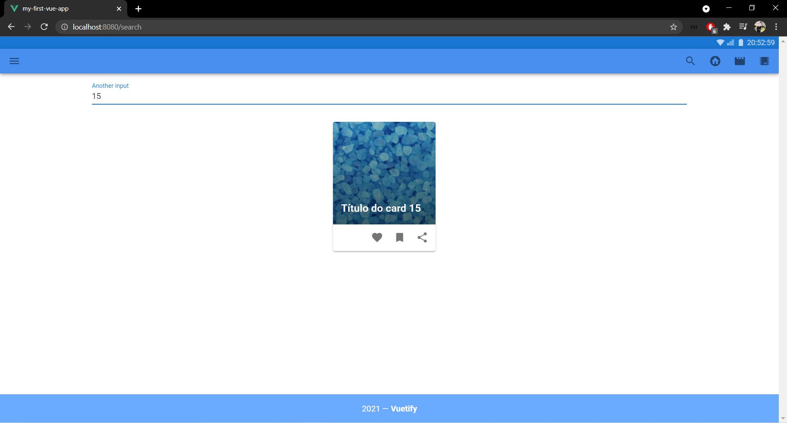
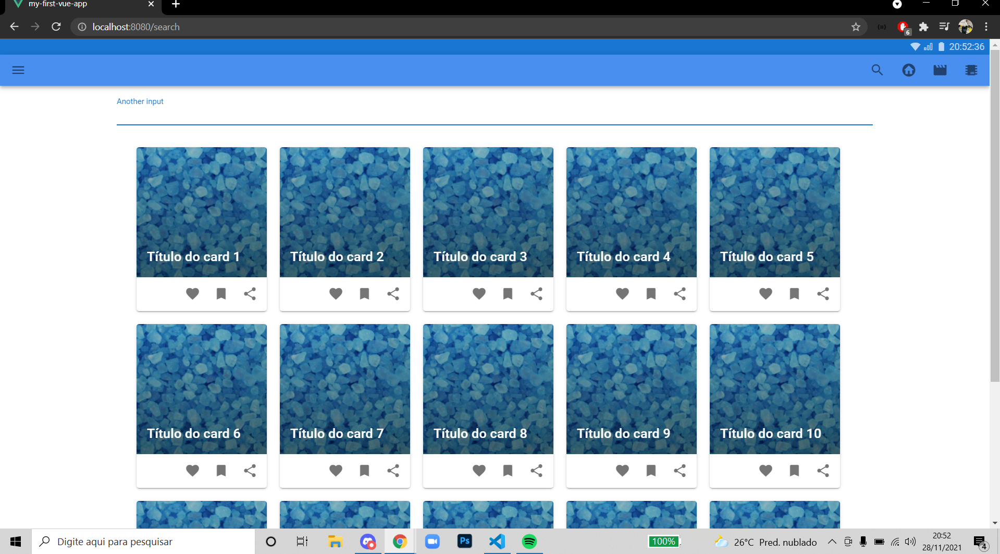
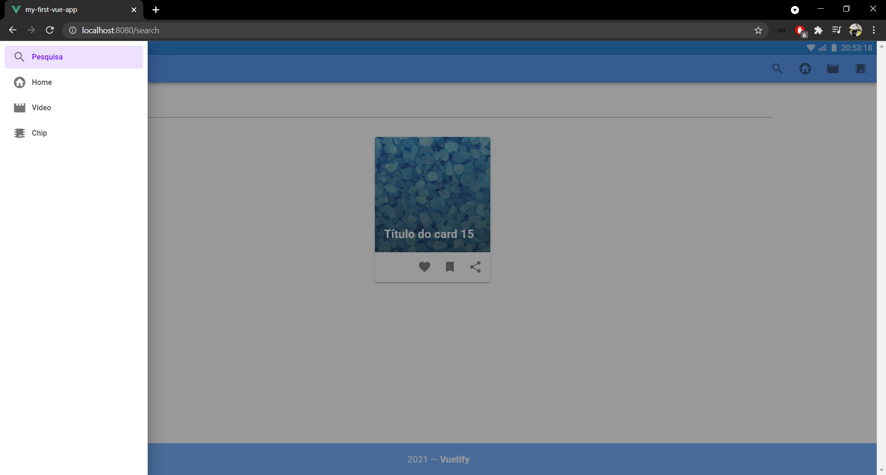

# my-first-vue-app
Seguem as imagens do projeto em sumilação que mostra como funciona em diversos tamanhos de dispositivos
<br/>
<br/>
<br/>
<br/>

## Project setup
```
npm install
```

### Compiles and hot-reloads for development
```
npm run serve
```

### Compiles and minifies for production
```
npm run build
```

### Lints and fixes files
```
npm run lint
```

### Customize configuration
See [Configuration Reference](https://cli.vuejs.org/config/).
